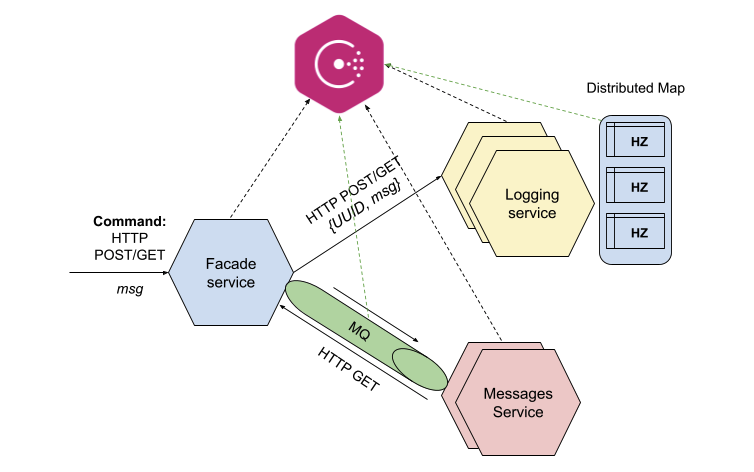

# Lab #5: Microservices with Consul

| Labs | Completion Status |
| -- | -- |
| Lab #1: Microservice Basics | ✅ |
| Lab #2: Hazelcast Basics | ✅ |
| Lab #3: Microservices & Hazelcast | ✅ |
| Lab #4: Microservices & Message Queue | ✅ |
| Lab #5: Microservices with Consul | ✅ |

## General Architecture


## Requirements
1. Python vesrion: `Python >= 3.7`
2. Install Kafka. [Link](https://kafka.apache.org/downloads).
3. Install Hazelcast & Management Center.
```css
brew tap hazelcast/hz 
brew install hazelcast
brew install hazelcast-management-center
```
4. Install Consul.
```css
brew install consul
```

## Run Project
1. Start Kafka Zookeeper & Broker.
```bash
# Start Zookeeper. Running on 127.0.0.1:2181
zookeeper-server-start.sh config/zookeeper.properties

# Start Kafka Broker. Running on 127.0.0.1:9092
kafka-server-start.sh config/server.properties

# Create Kafka Topic if not created.
kafka-topics.sh --bootstrap-server 127.0.0.1:9092 --topic MessageServiceTopic --create --partitions 3 --replication-factor 1
```
2. Start Hazelcast (3 Instances).
```bash
# Start Hazelcast Instance. 
hz start

# Start Hazelcast Management Center. Running on localhost:8080
hz-mc start
```
3. Start Consul.
```bash
# Start Consul agent. Running on localhost:8500
consul agent -dev

# Initialize values in KV storage.
sh consul_init.sh
```
4. Start Facade-Service.
```bash
~/facade-service $ sh start-service.sh 8081 
```
5. Start Logging-Service (3 Instances).
```bash
~/logging-service $ sh start-service.sh 8082 
~/logging-service $ sh start-service.sh 8083
~/logging-service $ sh start-service.sh 8084
```
6. Start Message-Service (2 Instances).
```bash
~/message-service $ sh start-service.sh 8085
~/message-service $ sh start-service.sh 8086
```